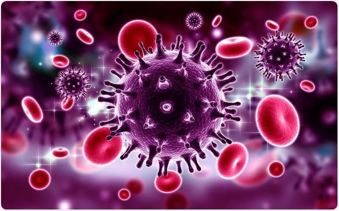

# Introduction

## Sous-partie

Texte en **gras** et en _italique_.

Ca serait bien [d'améliorer le chapitre Prévention](partie-1/prevention-du-vih.md#sous-partie-2).

## Seconde sous-partie

### Titre de niveau 2

#### Titre de niveau 3

Il est possible de faire des encadrés \(voir ci-dessous\).


**ATTENTION**

Ceci est une information mise en lumière




```r
mean(1:6)
```



```
3.5
```



Table 1: Titre du tableau

| xccccc | xxxxx |
| :--- | :---: |
| ccc | cccc |
| ccccc | aaaaaaa |







n,b,nb,nb







